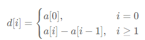

# 数据结构

## 枚举右维护左
对于双变量问题,根据条件枚举右边x,转换为单变量问题;一般是使用**cnt=defaultdict(int)** 进行记录

## 前缀和
前缀步骤:
```python
# 长度
s = [0] * (len(nums) + 1)

# 下标从0开始, s[i+1] 是带nums[i] == s[i] 是不带nums[i]; 
# s[i] == nums[0~i-1]

for i, x in enumerate(nums):
    s[i + 1] = s[i] + x

# 求某段前缀和[l, r]; 带上边界
s[r+1] - s[l]
```

后缀步骤:
```python
suf = [0] * (n+1)
# 带上自己; 从n-1开始
# suf[i] == nums[-1:-i]
for i in range(n-1, -1, -1):
    suf[i] = suf[i+1] + nums[i]
```
 
## 二维前缀和
前缀步骤:
```python
s = [[0] * (n + 1) for _ in range(m + 1)]
# 使用[i+1][j+1] 不需要特殊处理第一行/列

for i, row in enumerate(matrix):
    for j, x in enumerate(row):
        s[i + 1][j + 1] = s[i + 1][j] + s[i][j + 1] - s[i][j] + x

# 返回左上角在 (r1, c1)，右下角在 (r2, c2) 的子矩阵元素和
# 这个还是不带自己
s[r2 + 1][c2 + 1] - s[r2 + 1][c1] - s[r1][c2 + 1] + s[r1][c1]

```

# 差分
作用：对整个区间进行+-操作
差分数组：
对于数组 a，定义其差分数组（difference array）为

 
性质 1：从左到右累加 d 中的元素，可以得到数组 a。
性质 2：如下两个操作是等价的。
- 把 a 的子数组 a[i],a[i+1],…,a[j] 都加上 x。
- 把 d[i] 增加 x，把 d[j+1] 减少 x。

**二维差分暂不考虑**

# 栈

## 单调栈
主要是要维护一些性质，满足就pop；

# 队列

# 堆
Python 中通过标准库`heapq`实现堆结构，默认是**最小堆**（即堆顶元素为最小值）
最大堆需要元素取反实现

```python
heapq.heappush(heap, item)        
heapq.heappop(heap)
heapq.heapify(x)

heapq.heappushpop(heap, item): 
先将`item`推入堆，再弹出并返回堆的最小元素，比单独调用`heappush`+`heappop`更高效。

heapq.heapreplace(heap, item):
先弹出并返回堆的最小元素，再将`item`推入堆，比单独调用`heappop`+`heappush`更高效
```

插入元素，按照某个索引值排序
```python
heapq.heappush(heap, (task[1], task))
```

heappush()          O(logn)
heappop()          O(logn)
heapify()          O(n)
heappushpop()          O(logn)
heapreplace()          O(logn)

## 懒删除堆
当remove的时候先不删除，当top(查看堆顶)、pop(出堆)的时候，正式删除

```python
class LazyHeap:
    def __init__(self):
        self.heap = []  # 最小堆（最大堆可以把数字取反或重载__lt__）
        self.remove_cnt = defaultdict(int)  # 每个元素剩余需要删除的次数
        self.size = 0  # 堆的实际大小

    # 删除
    def remove(self, x: Any) -> None:
        self.remove_cnt[x] += 1  # 懒删除
        self.size -= 1

    # 正式执行删除操作
    def _apply_remove(self) -> None:
        while self.heap and self.remove_cnt[self.heap[0]] > 0:
            self.remove_cnt[self.heap[0]] -= 1
            heappop(self.heap)

    # 查看堆顶
    def top(self) -> Any:
        self._apply_remove()
        return self.heap[0]  # 真正的堆顶

    # 出堆
    def pop(self) -> Any:
        self._apply_remove()
        self.size -= 1
        return heappop(self.heap)

    # 入堆
    def push(self, x: Any) -> None:
        if self.remove_cnt[x] > 0:
            self.remove_cnt[x] -= 1  # 抵消之前的删除
        else:
            heappush(self.heap, x)
        self.size += 1
```

# 并查集


