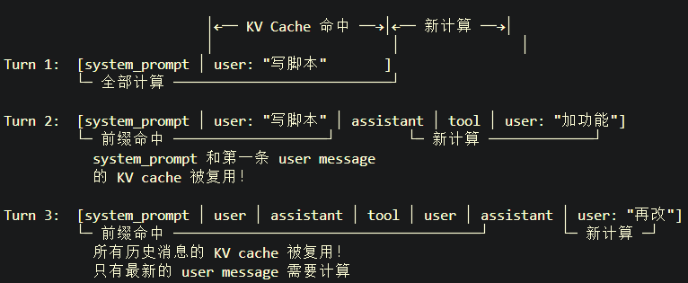

# hermes VS deer

# 退出session再次进入，会重建prompt吗？

## deer
当当前session结束后，chat-loop就会结束，所有的东西都会失效；再次进入聊天页后，会重建**make_lead_agent**, 重新生成**system_prompt**；

prompt主要包含的变量(可能改变的部分——从前往后)：
```markdown
- {agent_name}
- {soul}
- {memory_context}
- {subagent_thinking}
- {skills_section}
- {deferred_tools_section}
- {subagent_section}
- {acp_section}
- {subagent_reminder}
```

## hermes
流程是这样的：


时刻 T0: hermes 启动 → 全新 CLI + 全新 AIAgent
    └─ build_system_prompt() → 拼装完整 system prompt
    └─ 写入 SQLite: sessions 表 system_prompt 列 = 这个完整字符串

时刻 T1: 你发消息 "写个脚本" → agent.run_conversation(..., conversation_history=[])
    └─ _restore_or_build_system_prompt(): history 为空 → 不用恢复
    └─ 首次构建 _cached_system_prompt，写入 SQLite

时刻 T2: 你发 "加个功能"
    └─ conversation_history = [上一条 user, assistant, tool...]
    └─ _restore_or_build_system_prompt(): history 非空
    └─ SQLite 查询 → stored_prompt 有值 → 直接赋值！
        agent._cached_system_prompt = stored_prompt   ← 和上一轮字节完全相同

时刻 T3: 你 /quit 退出

时刻 T4: hermes --continue 重进
    ├─ 全新进程！全新 HermesCLI！全新 AIAgent！
    ├─ conversation_history 从 SQLite 恢复 (cli.py 第 4480 行):
    │   restored = self._session_db.get_messages_as_conversation(self.session_id)
    │   self.conversation_history = restored
    │
    └─ 然后发消息调用 agent.run_conversation(conversation_history=restored)
        └─ _restore_or_build_system_prompt():
            since conversation_history is NOT empty:
            stored_prompt = session_row["system_prompt"]
            # ← 这是 T1 时刻写入的那个完整 system prompt 字符串！
            agent._cached_system_prompt = stored_prompt
            # ← 和 T1、T2 时刻字节完全相同
所以答案：退出重进后，系统提示词和之前完全相同。不是"重建一个一样的"，而是"直接拿回之前那个字符串"。

# 对话状态一直在变，KV Cache 能缓存啥？

KV Cache 是前缀匹配，不是全量匹配。


## 项目中KV一些问题

### 在这个项目里，请求前缀一定固定吗？
```text
A. agent 创建时生成的 system_prompt
B. 每次发给 LLM 的 messages
C. 每次绑定给 LLM 的 tools/schema
```

A: 一般是固定的，agent创建时生成一次，一般情况下不变
B
问题：中间件是不是只会在后面加内容，不会改前面？
答案：不是。当前项目里有些 middleware 会追加，有些会修改当前消息，有些会插入历史中间，有些会压缩历史。

```
DanglingToolCallMiddleware 会扫描历史，如果发现某条 AIMessage 有 tool_calls 但缺少对应 ToolMessage，会在那条 AIMessage 后面插入一个 synthetic ToolMessage。也就是说它可能修改消息历史中间部分。

SummarizationMiddleware 更明显。上下文太长时，它会摘要/裁剪历史消息。这样请求里较早的 conversation 部分会被替换，不是简单 append。

TodoMiddleware 会在模型调用前注入 todo reminder。这个通常是追加一条 HumanMessage，但它会改变下一次模型调用看到的上下文。

LoopDetectionMiddleware 可能在检测到重复工具调用后注入 warning，或者修改最后一条 AIMessage，清空 tool_calls，强制停止循环。

```

真实情况是：
```
system_prompt 可能稳定
但 messages 会持续变化
而且不是只在末尾追加
```


C:
这个项目还有 DeferredToolFilterMiddleware 和 tool_search。

一开始 MCP 工具可能是 deferred：
```
模型只看到 tool_search
看不到所有 MCP tool schema
```
当模型调用 tool_search 后，某些工具被 promote，后续模型调用时可见 tool schema 变化

所以:
```text
第一次模型调用：tools = builtin tools + tool_search
后续模型调用：tools = builtin tools + promoted MCP tools
```

### langchain保证system_prompt不会改变
主要靠 LangChain/LangGraph 的 agent 执行模型保证：**system_prompt 是 create_agent() 时传进去的静态参数**，中间件一般操作的是每次运行时的 state、request.messages、request.tools、tool call，而不是回头改 create_agent() 里的 system_prompt 字符串。

中间件后续拿到的 hook 参数主要是：
```
before_agent(state, runtime)
before_model(state, runtime)
wrap_model_call(request, handler)
after_model(state, runtime)
wrap_tool_call(request, handler)
after_agent(state, runtime)

这些 hook 的能力边界是修改：
state["messages"]
request.messages
request.tools
tool call/result
runtime/context
```

一次调用大概是：
```
create_agent(system_prompt=固定模板)
        |
用户调用 agent.ainvoke(...)
        |
LangGraph 读取 checkpoint 中的 ThreadState
        |
before_agent middlewares
        |
进入 ReAct 循环：
  before_model middlewares
  wrap_model_call middlewares
    -> LangChain 把 system_prompt + state.messages + tools 组装成模型请求
    -> 调 LLM
  after_model middlewares
  如果有 tool_calls：
      wrap_tool_call middlewares
      执行工具
      工具结果写回 messages
      回到 model
  如果没有 tool_calls：
      结束
        |
after_agent middlewares
        |
写 checkpoint
```


### 服务端 KV cache 是如何更新的？每次调用都会更新吗？

请求：```messages + tools + params```
服务端：
```
1. 把请求 tokenize
2. 查找前缀是否命中过去缓存
3. 命中部分复用 KV
4. 未命中部分正常 prefill 计算
5. 生成输出
6. 按服务商规则把可缓存前缀写入/更新缓存
```

deepseek缓存规则：
```
1. 请求边界持久化
   每次请求会在用户输入结束位置、模型输出结束位置生成 cache prefix unit。

2. 公共前缀检测
   如果系统发现多个请求有共同前缀，会把共同前缀作为独立 cache prefix unit。

3. 固定 token 间隔持久化
   对很长输入/输出，会按固定 token 间隔切出 cache prefix unit。

后续请求必须完整匹配一个已经持久化的 cache prefix unit，才能命中。
```
看不懂
例子：
```
第一次请求：A + B
第二次请求：A + B + C
第二次可以命中 A + B

第一次请求：A + B
第二次请求：A + C
第二次不能直接命中 A + B
但系统可能识别共同前缀 A 并持久化
第三次 A + D 才可能命中 A
```

```
每次请求都有可能产生/更新缓存；
但不是每次请求都一定马上让下一次请求命中；
缓存构建是 best-effort；
构建需要几秒；
不保证 100% 命中；
不用后会自动清理。
```

缓存生效流程：
```
请求 1:
  prefix = system_prompt + user A
  服务端计算 prefill KV
  请求完成后持久化若干 prefix units

请求 2:
  prefix = system_prompt + user A + assistant + user B
  服务端检查前缀
  如果前面部分完整匹配已持久化 unit
      命中 -> 复用 cached KV
      剩余部分正常计算
  请求完成后继续生成新的 prefix units

请求 3:
  如果继续复用相同前缀
      命中更多
```


