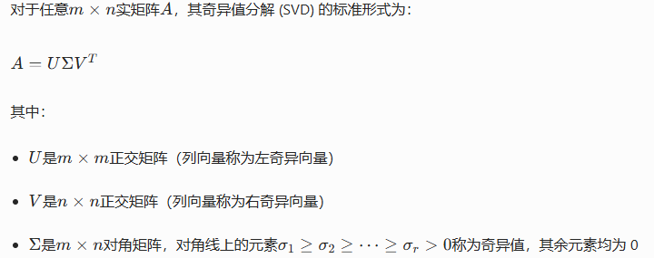
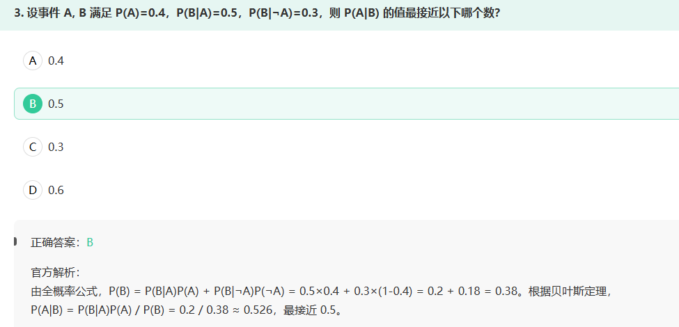
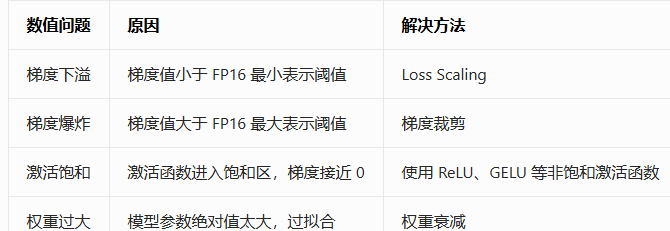

# ρxy
相关系数的取值含义：

\(\rho=1\)：完全正线性相关
\(\rho=-1\)：完全负线性相关
\(0<|\rho|<1\)：存在一定程度的线性相关
\(\rho=0\)：不相关（无线性相关关系）

这说明皮尔逊相关系数只能衡量线性相关程度，不能衡量非线性相关程度。

# 奇异值分解SVD

矩阵的秩定义为矩阵中线性无关的列（或行）向量的最大个数。对于奇异值分解，有一个核心性质：
- 正交矩阵是满秩可逆矩阵，矩阵与可逆矩阵相乘不改变其秩。

- 迹是矩阵对角元素的和，而不是个数。
- 非零奇异值的个数r就是矩阵A的秩

只有当A是列满秩矩阵时，\(\text{rank}(A)=n\)
一般情况下，\(\text{rank}(A)\leq n\)，两者不相等

只有当A是行满秩矩阵时，\(\text{rank}(A)=m\)
一般情况下，\(\text{rank}(A)\leq m\)，两者不相等

# 概率论

# Loss Scaling

混合精度训练是将模型的权重、激活值和梯度同时用 FP16（半精度浮点数）和 FP32（单精度浮点数）表示的训练技术，其核心目标是在几乎不损失精度的前提下，将训练速度提升 2 倍，显存占用减少一半。

但 FP16 格式存在一个致命缺陷：数值范围极窄，无法表示太小的数值。

二、梯度下溢是如何发生的？
在深度学习训练中，梯度值通常非常小，尤其是在：
模型训练的后期，损失函数接近收敛，梯度变得极小
深层神经网络的浅层，梯度经过多次反向传播后会指数级衰减
使用 sigmoid、tanh 等容易饱和的激活函数时，梯度会接近 0

Loss Scaling（损失缩放）是专门为解决 FP16 梯度下溢问题设计的技术，其核心思想非常简单：放大损失，让梯度也跟着放大，避免被舍入为 0。

动态 Loss Scaling：
为了避免缩放因子S过大导致梯度爆炸（超过 FP16 的最大值\(6.55\times10^4\)），实际应用中通常使用动态 Loss Scaling：

- 如果梯度中出现 inf 或 nan，说明S太大，将S减半
- 如果连续 N 步都没有出现 inf 或 nan，说明S可以增大，将S加倍

解决权重过大的标准方法是权重衰减（Weight Decay），这是一种正则化技术

错误原因：激活饱和是指激活函数的输出进入饱和区（如 sigmoid 的输出接近 0 或 1），导致梯度接近 0。
这是激活函数本身的性质问题，与数值精度无关

- 解决激活饱和的方法是使用 ReLU、GELU 等非饱和激活函数

投影值等于数据点向量与单位特征向量的内积

# Layer Normalization（LN）核心性质

## A
根据 Layer Normalization 在残差块中的位置不同，确实分为Pre-LN和Post-LN两种架构：
Post-LN：原始 Transformer 采用的结构，顺序为「Attention/FFN → 残差连接 → LayerNorm」
Pre-LN：现代大模型（LLaMA、GPT 系列）普遍采用的结构，顺序为「LayerNorm → Attention/FFN → 残差连接」
考点延伸：Pre-LN 训练更稳定，能支持更深的模型；Post-LN 收敛更快但容易出现梯度爆炸，需要配合学习率预热。

## B
RMSNorm 去掉了减去均值的部分，而不是 LN。

RMSNorm 的优势：计算速度更快，同时在大模型中表现出与 LN 相当的性能，因此被 LLaMA 2/3、Mistral 等主流大模型采用。

## C
这是 Layer Normalization 的标准计算流程：

1, 对每个样本的所有特征维度计算均值\(\mu\)和方差\(\sigma^2\)（注意：BN 是对每个特征维度在 batch 内计算均值方差，这是 LN 与 BN 的核心区别）
2, 对每个特征值进行归一化：\(x' = \frac{x - \mu}{\sqrt{\sigma^2 + \epsilon}}\)（\(\epsilon\)是防止除零的小常数）
3, 应用可学习的仿射变换：\(y = \gamma x' + \beta\)，恢复模型的表达能力

## SGD 
在狭长山谷曲面（病态曲率）中，SGD 容易在曲率大的方向上反复震荡，而在曲率小的（真正指向极小值的）方向上推进极慢，导致整体收敛缓慢。这正是引入动量（Momentum）机制想要解决的问题。

