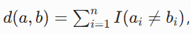

# 笔试选择题04


BM25检索： 最传统的关键词搜索，只看 "你搜的词在文档里出现了多少次"。比如：你搜 "苹果"，它就找所有包含 "苹果" 这两个字的文档，出现越多排越前

BM25 有一个致命缺陷：它只能匹配完全一样的关键词，完全不懂语义

## 张量并行

张量并行（Tensor Parallelism）是一种层内并行技术，它的核心思想非常简单：
把同一个神经网络层内部的大矩阵，沿着某个维度切成小块，分别放到不同的 GPU 上计算，最后通过通信合并结果

**ZeRO 优化器（零冗余优化器** 的核心逻辑： 按优化器状态切分，不同 GPU 维护不同的优化器状态

- 优化器状态（比如 Adam 的动量和方差）占显存非常大，通常是权重的 2 倍
- ZeRO 把优化器状态、梯度甚至权重都切分到不同 GPU 上，需要的时候再通过通信获取
- 它解决的是 "优化器状态和梯度占用太多显存" 的问题，而不是 "单个层权重太大" **的问题**

**流水线并行（Pipeline Parallelism, PP）** 的核心逻辑：按网络层深度切分，不同层放在不同 GPU 上

- 它是一种层间并行技术：把整个模型按层分成几个阶段，每个 GPU 负责一个阶段的几层
- 比如模型有 10 层，GPU0 放 1-2 层，GPU1 放 3-4 层，...，GPU4 放 9-10 层
- 它解决的是 "整个模型太大，单卡放不下所有层" 的问题，但要求单卡至少能放下它负责的那几层
- 如果单个层就比单卡显存大，流水线并行完全失效

**数据并行（Data Parallelism, DP** 的核心逻辑：按批次大小切分，不同样本放在不同 GPU 上

- 每个 GPU 都有完整的模型副本
- 把一个大批次的训练数据切成小批次，每个 GPU 计算自己小批次的梯度
- 最后所有 GPU 汇总梯度，更新模型权重
- 它解决的是 "批次太大，单卡算不过来" 的问题，但要求单卡能放下整个模型
- 是所有并行方式的基础，通常和张量并行、流水线并行结合使用

## KV Cache（键值缓存）：
把之前计算过的所有历史 token 的 K（键）和 V（值）向量存起来，生成新 token 时直接用，不用重新计算。但是显存已经被 KV Cache 占满了，但用户还在继续说话，需要生成更多新 token

解决：将部分 KV Cache swap 到 CPU 或进行 recomputation； 把最早的给CPU或者直接丢弃，重新进行计算

模型精度（FP16、BF16、INT8、INT4）是模型加载时就确定好的，需要把整个模型的权重都转换成对应精度才能运行；节省模型权重的显存


在流水线并行（Pipeline Parallel）中，一个模型被切分为多个 Stage，分布在不同 GPU 上。当某些 GPU 在等待上游 Stage 的计算结果时出现空闲，这种现象被称为？ **Pipeline Bubble（流水线气泡）**

- 显存碎片是指显存中存在很多不连续的小块空闲空间，无法被用来分配大的连续内存块。
- GPU 上下文切换是指GPU 在多个不同的任务之间切换时产生的开销。
- 网络拥塞是指GPU 之间的通信带宽不够，导致数据传输太慢

## 层次聚类（Hierarchical Agglomerative Clustering

层次聚类（Hierarchical Agglomerative Clustering，凝聚式层次聚类）是最经典的聚类算法之一，它的核心思想非常直观：
- 一开始每个数据点都是一个单独的簇，然后每次找到距离最近的两个簇，把它们合并成一个新的簇，重复这个过程直到所有数据点都在同一个簇里

### Complete Linkage（全链接法 / 完全连接法）
定义：两个簇之间的距离，等于两个簇中所有数据点对之间的最大距离
大白话：把两个簇想象成两个班级，两个班级之间的距离，就是两个班级中离得最远的两个人之间的距离
特点：对异常值比较敏感，倾向于生成比较紧凑、大小相近的簇

### Expectation-Maximization（EM 算法）
这是一种通用的参数估计算法，不是聚类算法，更不是簇间距离的定义方式。
它的作用是：当概率模型中有未知的隐变量时，通过迭代的方式估计模型的参数
最常见的应用是高斯混合模型（GMM）聚类，GMM 用 EM 算法来估计每个高斯分布的均值和方差
和层次聚类完全没有关系

### K-means
这是一种划分式聚类算法，和层次聚类是完全不同类型的聚类方法。
K-means 需要预先指定簇的数量 k，然后通过迭代把数据点分配到最近的簇中心
它计算的是数据点到簇中心的距离，而不是两个簇之间的距离
层次聚类不需要预先指定 k，这是它和 K-means 最本质的区别之一

### DBSCAN
这是一种基于密度的聚类算法，同样和层次聚类是不同类型的方法。
DBSCAN 不需要预先指定簇的数量，它通过数据点的密度来发现任意形状的簇
它的核心概念是 "核心点"、"边界点" 和 "噪声点"，根本不使用 "簇间距离" 这个概念
特别适合处理含有噪声和异常值的数据

## pytorch 函数
```python
# 步骤1：梯度清零（每轮开始前必须做）
optimizer.zero_grad()

# 步骤2：前向传播计算损失
outputs = model(inputs)
loss = criterion(outputs, labels)

# 步骤3：反向传播计算梯度
loss.backward()

# 步骤4：优化器更新参数（本题考点）
optimizer.step()
```

## 数学运算
黎曼积分（等距划分）： 把积分区间等分成 N 个小矩形，用所有小矩形的面积之和近似积分值
蒙特卡洛积分： 在积分区间内随机采样 N 个点，计算这些点的函数值的平均值，再乘以区间长度（这里是 1），就得到积分的近似值


- 低维用黎曼，高维用蒙特卡洛

收敛速度：等距黎曼\(O(N^{-1})\) > 蒙特卡洛\(O(N^{-1/2})\)
维度灾难：黎曼积分在高维时失效，蒙特卡洛收敛速度与维度无关
适用场景：低维用黎曼，高维用蒙特卡洛

## Transformer的Decoder来自哪里


## 多模态
多模态大模型的基本架构是 "视觉编码器 + 连接器 + 大语言模型（LLM）" 三部分：
- 视觉编码器（比如 ViT、CLIP-ViT）：把图片转换成一系列视觉特征向量
- 大语言模型（比如 LLaMA、Qwen）：只能理解自己的文本嵌入空间里的向量
- 连接器（Connector）：核心任务是把视觉编码器输出的视觉特征，映射到 LLM 的文本嵌入空间，让 LLM 能 "看懂" 图片

连接器: 

连接器类型	核心思想	非线性能力	计算量	训练难度	代表模型	适用场景
线性投影层	直接线性映射	无	     极小	极低	LLaVA-1.0、CLIP	简单场景、追求速度、数据量小
MLP	       非线性映射	  中等	    中等	中等	BLIP-1、FLAVA	中等复杂度场景
Q-Former   查询式信息提取	强	    较大	较高	BLIP-2、LLaVA-1.5	复杂场景、追求最高性能


## 向量相似度
适用于机器学习中度量两个特征向量的相似度的有?

欧氏距离（Euclidean Distance）： 
这是最基础、最常用的距离度量，衡量两个向量在 n 维空间中的直线距离。

余弦相似度（Cosine Similarity）
这是高维稀疏向量中最常用的相似度度量，衡量两个向量之间的夹角大小。

汉明距离（Hamming Distance）
这是离散特征向量中最常用的距离度量，衡量两个等长向量中对应位置元素不同的个数。


KL 散度严格来说既不是距离，也不是特征向量相似度度量：
本质：衡量两个概率分布之间的差异，表示 "用分布 Q 来近似分布 P 时产生的信息损失"
正确用途：用于比较两个概率分布的差异，比如在生成模型中衡量生成分布和真实分布的差距。

## 反向传播
它的本质是利用链式法则，从输出层向输入层逐层计算每个参数的梯度。整个过程分为两步：
- 前向传播：输入数据从输入层流向输出层，计算出预测值和损失值，同时存储所有中间层的激活值
- 反向传播：从损失值开始，沿着计算图反向流动，计算出每个参数的梯度，用于后续的参数更新

正确选项 A：反向传播的计算量大约是前向传播的 2 倍

正确选项 C：反向传播需要存储所有中间层的激活值，因此显存消耗大
这是反向传播最主要的缺点，也是大模型训练显存瓶颈的核心来源：
反向传播计算梯度时，必须用到前向传播中每个层的输入和输出激活值
比如计算线性层的权重梯度dW，需要用到前向的输入X和上层传下来的梯度dY
如果不存储这些激活值，就无法计算梯度
显存占比：在大模型训练中，中间激活值的显存占用通常会超过模型权重本身

为了解决这个问题，才有了 **激活重计算（Activation Recomputation** 技术：在反向传播时重新计算某些激活值，而不是存储它们，用计算时间换显存空间

正确选项 D：相比于数值微分，符号微分计算梯度的速度快
这是一个数量级的差异，两者的速度根本不在一个层面上

方法	核心原理	   计算速度	               精度	                 适用场景
数值微分	有限差分近似	极慢（O (N)）	低（有截断误差）	梯度检查、简单函数验证
符号微分	推导解析表达式	快（O (1)）	          高	            简单数学函数、理论分析
自动微分	计算图 + 链式法则	极快（O (1)）	高	            所有现代深度学习框架

