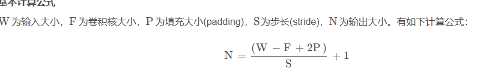
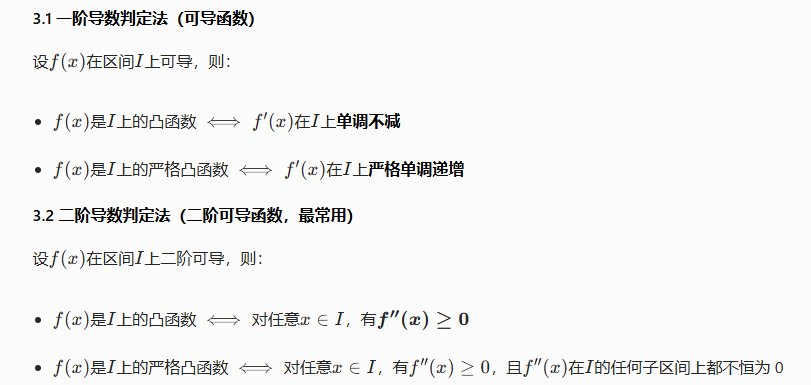
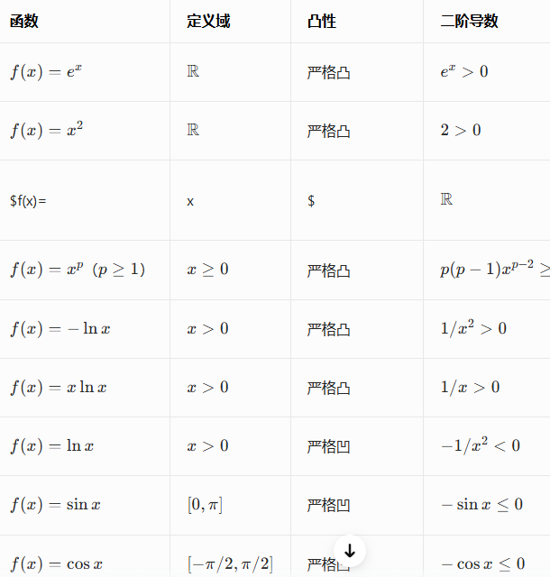
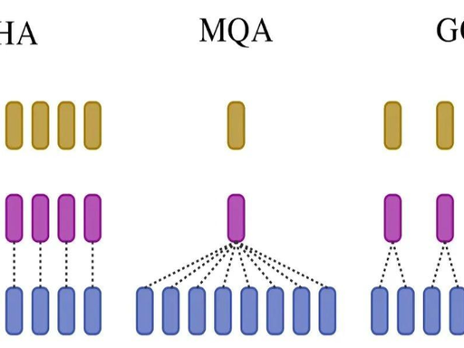

# 量化技术与数值格式

## FP32（单精度浮点数）
- 位分配：1 位符号位 + 8 位指数位 + 23 位尾数位
- 数值范围：±1.175×10⁻³⁸ ~ ±3.403×10³⁸
- 精度：约 6-7 位十进制有效数字
- 特点：精度最高，计算稳定，但存储和计算开销大
- 应用：传统深度学习训练的默认格式
- 4 字节

## FP16（半精度浮点数）
- 位分配：1 位符号位 + 5 位指数位 + 10 位尾数位
- 数值范围：±6.10×10⁻⁵ ~ ±6.55×10⁴
- 精度：约 3-4 位十进制有效数字
- 特点：存储体积是 FP32 的 1/2，计算速度更快，但数值范围小，容易出现梯度下溢
- 应用：混合精度训练、模型推理
- 2 字节
  
## BF16（脑浮点数，Brain Float）
- 位分配：1 位符号位 + 8 位指数位 + 7 位尾数位
- 数值范围：与 FP32 完全相同（±1.175×10⁻³⁸ ~ ±3.403×10³⁸）
- 精度：约 2 位十进制有效数字
- 特点：指数位与 FP32 一致，转换时无需缩放，数值范围大，不易溢出，但精度比 FP16 低
- 应用：大语言模型训练（LLaMA、GPT 系列）、Google TPU 原生支持
- 2 字节

INT8（8 位整数）
- 应用：工业级模型推理、边缘设备部署
- 1字节

# 卷积输出公式

# 凹凸函数

凸函数的判定方法（核心考点，必考）：

线性回归、逻辑回归、SVM 都是凸优化问题；神经网络的损失函数不是凸函数

- 若\(f(x)\)是凸函数，则\(-f(x)\)是凹函数

- \(f''(x)\geq0\)只能说明是凸函数，不一定严格；例如\(f(x)=1\)，\(f''(x)=0\)，是凸函数但非严格

- 凸函数的非负线性组合仍是凸函数，系数为 1 时和也是凸函数
- 多个凸函数的最大值函数仍是凸函数

# Pass@k
Pass@k 是由 OpenAI 在 2021 年论文《Evaluating Large Language Models Trained on Code》中提出的，现已成为代码生成领域最权威、最通用的评估指标。

在实际应用中，最常用的是以下几个变体：

Pass@1：每个问题生成 1 个候选，通过的概率。最严格的指标，反映模型 "一次生成正确" 的能力。
Pass@10：每个问题生成 10 个候选，至少有一个通过的概率。
Pass@100：每个问题生成 100 个候选，至少有一个通过的概率。最宽松的指标，反映模型的上限能力。

# 多头注意力（MHA）和分组查询注意力（GQA）的区别

分组查询注意力 (GQA)：针对 KV 缓存的革命性优化

GQA 的核心洞察是：注意力头之间存在大量冗余，多个查询头可以共享同一组键和值。它将 h 个查询头划分为 g 个组（g < h），每组内的所有查询头共享同一个 K 头和 V 头。

GQA 的核心思想与解决的问题
核心思想：将查询头分组，每组共享一组 K/V，减少 KV 头数量
解决的问题：大模型自回归推理中的 KV 缓存内存瓶颈
本质：在 MHA 的高精度和 MQA 的高效率之间的最优折中

GQA 压缩比：\(h/g\)倍（h 是查询头数，g 是分组数）

# 训练和推理
训练的本质是 "计算损失→反向传播梯度→更新参数"，因此必须完整保留所有中间层的激活值，用于后续梯度计算。

推理的差异：推理只需要最终输出结果，不需要梯度，因此计算完一层的输出后可以立即丢弃该层的中间特征，大幅节省内存。

考点延伸：训练时的内存占用≈模型参数 + 梯度 + 中间激活（长序列下中间激活可能超过参数本身）；
推理时的内存占用≈模型参数 + KV 缓存（长序列下 KV 缓存占主导）。

KV Cache 特指自回归推理中，将历史 token 的 K/V 保存下来，复用给后续 token 生成的机制，这是推理独有的优化。

# 线性无关
线性无关的定义就是只有全零系数时，线性组合才可能等于零向量。

# 影响 GPU 内核占用率的因素

GPU 内核占用率是衡量流式多处理器（SM）资源利用率的关键指标，定义为：
\(\text{Occupancy} = \frac{\text{SM上同时活跃的线程束（Warp）数量}}{\text{该SM理论最大支持的线程束数量}}\)

线程束（Warp）：GPU 调度的基本执行单元，固定为 32 个线程
SM（流式多处理器）：GPU 的核心计算单元，包含 CUDA 核心、寄存器文件、共享内存等资源

本质：占用率反映的是 SM 硬件资源被充分利用的程度，取值范围为 0~1（或 0%~100%）

## A： 
每个 SM 的共享内存是固定且有限的硬件资源，同一 SM 上所有驻留线程块的共享内存总和不能超过 SM 的总共享内存容量。
## B: 
线程块的维度（特别是每个线程块的线程数，即 block size）直接决定了每个线程块包含的线程束数量，以及 SM 能容纳的最大线程块数量。
## C:
每个 SM 的寄存器文件（Register File）是固定且有限的硬件资源，同一 SM 上所有驻留线程的寄存器总数不能超过 SM 的总寄存器容量。

时钟频率影响的是内核的执行速度，而不是资源利用率（占用率）。

GPU 内核的理论最大占用率由以下三个因素中最严格的那个决定：
寄存器数量限制
共享内存数量限制
线程块数量限制

# 大模型单 token 生成延迟优化技术

单 token 生成延迟：从输入一个 token 到输出下一个 token 的时间，单位是 ms/token，直接影响用户体验

吞吐量：单位时间内模型能处理的总 token 数，单位是 tokens/s，直接影响服务成本

## A:INT8 权重量化 + GPU Tensor Core 执行

底层加速原理：
Tensor Core 硬件加速：现代 NVIDIA GPU（Ampere 及以上架构）的 Tensor Core 对 INT8 矩阵乘法有专门的硬件支持，INT8 吞吐量是 FP16 的 2 倍。
单 token 生成的核心计算是矩阵乘法（QKV 投影、FFN 层），INT8 矩阵乘法在 Tensor Core 上的执行时间确实比 FP16 短。
内存带宽降低：INT8 权重的体积是 FP16 的 1/2，从显存读取权重的时间减少一半。而单 token 生成时，内存带宽往往是主要瓶颈（因为计算量小，GPU 计算单元经常等待数据）。
KV 缓存同步减小：INT8 量化也可以应用于 KV 缓存，进一步减少内存带宽需求。

## C: 增大 Batch Size + 连续批处理（错误，高频坑点）
1, 增大 Batch Size 会增加单 token 延迟：GPU 是并行计算设备，当 Batch Size 从 1 增加到 32 时，GPU 需要同时处理 32 个请求的矩阵乘法。虽然总吞吐量提升了，但每个请求的计算时间也会变长，单 token 延迟通常会增加 2-4 倍。

2, 连续批处理只提升吞吐量，不降低延迟：连续批处理解决的是静态批处理中 "不同请求长度不一致导致的填充浪费" 问题，它能让相同 Batch Size 下的吞吐量提升 2-3 倍，但不会改变单个 token 的计算时间。

## D: FlashAttention、 FlashAttention-2 实现 Attention 计算（正确）
FlashAttention 是目前最先进的注意力计算优化技术，能同时提升吞吐量和降低延迟。

