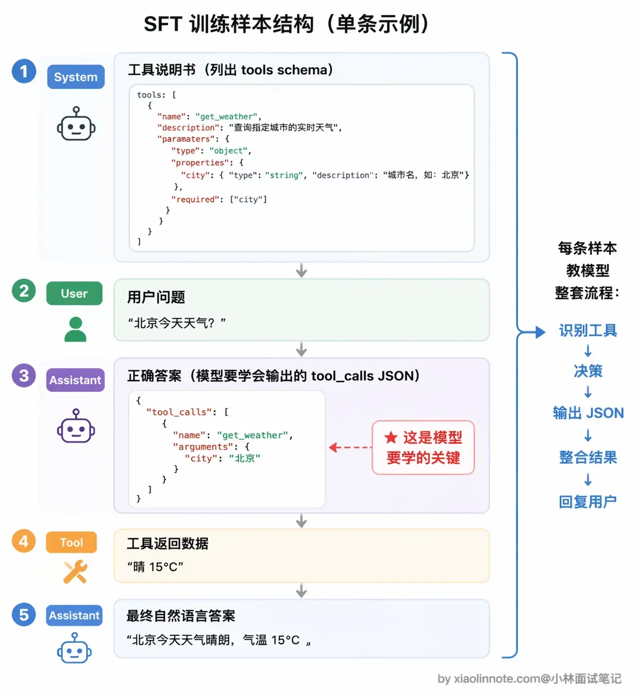
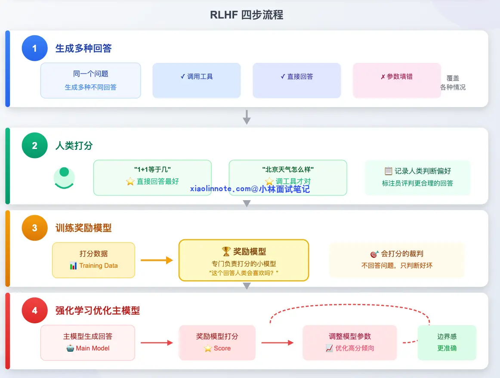

# LLM 是如何学会调用外部工具的？
SFT + RLHF（基于人类反馈的强化学习，Reinforcement Learning from Human Feedback）

回答模板：
```md
这道题我分两块来讲:模型怎么被训练出工具调用能力，以及训练好之后运行时是怎么工作的。
训练层面靠两个阶段:

- SFT(监督微调，Supervised Fine-Tuning):给模型喂大量「工具调用示范对话」，让它通过模仿学会「看到工具描述->判断要不要调->输出结构化JSON请求」这整套流程;

- RLHF(基于人类反馈的强化学习,Reinforcement Learing from Human Feedback):收集人类对「哪种回答更好」的判断，训练一个打分器，再用这个分数反复调整模型，让它学会什么时候不应该调工具。

运行层面，每次请求时，你的应用代码把工具描述(叫 schema，可以理解为工具的说明书)传给模型，模型如果判断需要工具，就输出一段结构化的tool1_ca11s JSON;你的代码拿到这段JSON去真正执行，把结果塞回对话，模型再给出最终答案。
有一点非常关键:模型全程只是在「下指令」，真正执行工具的是你的代码，不是模型本身。这套「模型决策、代码执行」的运行时机制，就是我们常说的Function Calling。
```

SFT 教会怎么调，RLHF 教会什么时候调。

## SFT，让模型「见过」工具调用

一条完整的训练样本长这样:

首先是 System 消息，也就是工具说明书，列出模型现在有哪些工具可用，每个工具叫什么名、能做什么事、需要什么参数，模型从这里「认识」工具。接着是 User 消息，就是用户的提问，比如「北京今天天气怎么样？」。

然后到了最关键的部分:Assistant 的调用请求。注意，这里的「正确答案」不是自然语言回答，而是结构化JSON，类似(“tool_calls":[(”name”:“get_ Meather",“arguments":"city":"北京"}]]}。这就是模型需要学会输出的东西。为什么是JSON而不是自然语言?因为JSON格式固定、机器好解析，你的代码才能准确读到「调哪个工具、参数是什么」。

再往后是Tool消息，模拟工具返回的数据，比如[晴，15°C，东北风3级」。最后是Assistant的最终回答，模型看到工具结果后，给出自然语言答案:[北京今天天气晴朗，气温15°C......。


## RLHF，用反馈建立边界感


