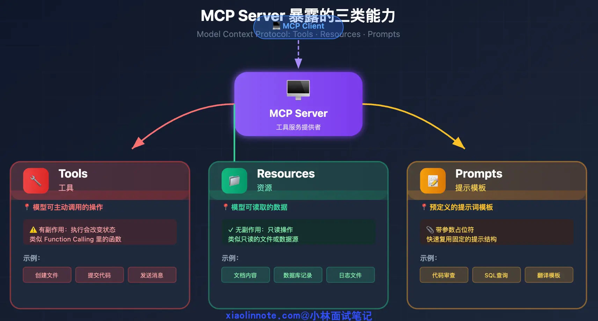
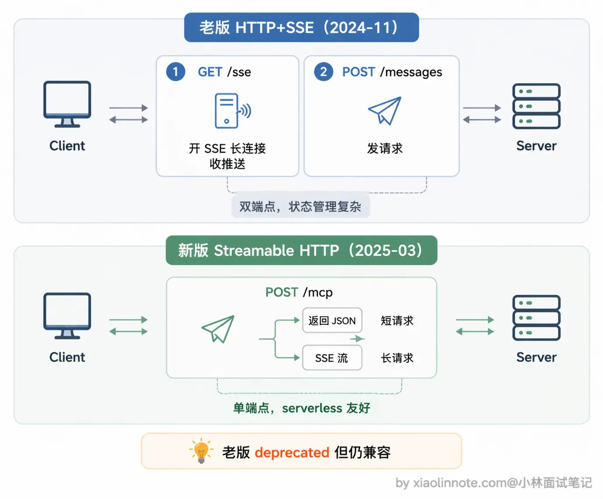
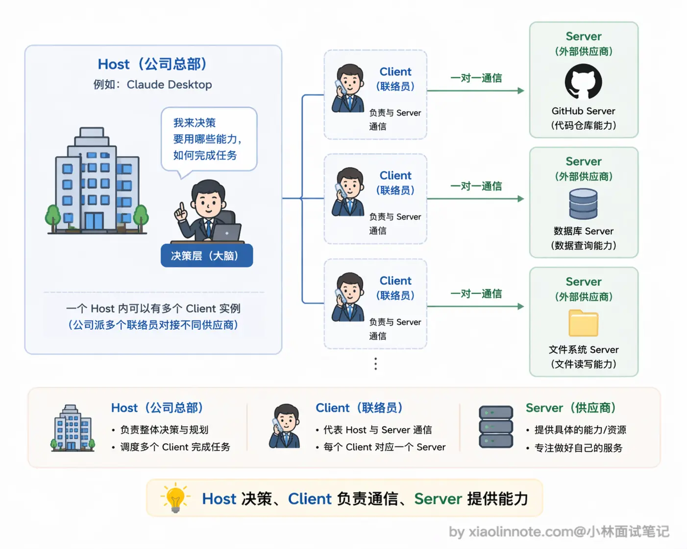

# 什么是 MCP（模型上下文协议）？讲讲它的核心内容？

回答：
```text
MCP是Anthropic在2024年底推出的开放协议，我理解它主要解决的是「模型接工具太碎片化」的问题。在MCP出现之前，每接一个新工具都要单独写集成代码、处理认证、适配格式，而且这套代码和具体模型强绑定，换个模型就得重写，非常繁琐。

MCP的思路是把这件事标准化:工具提供方按协议实现一个Server，任何支持MCP的AI客户端就能直接接进来，一次实现到处复用。

协议定义了三类能力:Tools 用于执行有副作用的操作，Resources 是只读数据，Prompts是提示词模板，底层通信用JSON-RPC2.0.

我把它理解成给「AI接工具」这件事定了一套行业标准。
```

## MCP出现之前
1. 手写 GitHub API 的调用代码
2. 处理认证（OAuth token 怎么传）
3. 处理各种返回格式
4. 把 API 响应转成模型能理解的格式
5. 

## MCP出现之后

MCP做的是同一件事:为「AI接工具」这件事定了一套统一的协议标准。工具提供方(比如GitHub官方)按MCP规范实现一个MCP Server，里面封装好各种操作。任何支持MCP 的AI客户端，Claude Desktop、Cursor、各种Agent框架，都能直接连上这个Server，自动发现里面的工具并使用，不需要写任何定制化对接代码。工具只需要实现一次，到处复用。

## MCP Server三类核心能力
Tools、Resources、Prompts



### Tools

Tools (工具)，这是最核心的能力，对应Function Calling里的「函数」。Tools 的本质是「有副作用的操作」，什么叫有副作用?就是***执行之后会改变外部世界的状态***。创建文件、提交代码、发送Slack消息、调用第三方APl，这些都属于Tools，因为执行完之后环境发生了变化，而且往往不可逆。正因为如此，Tools通常需要用户授权确认才能执行，不能让模型想调就调。

### Resources（资源）

Resources(资源)，它和Tools最本质的区别就一个字:只「读」。Resources不会改变任何东西，只是把数据提供给模型看。读取日志文件、查询数据库记录、获取文档内容，都属于Resources的范畴。你可以把Resources理解成「工具的资料室」，模型可以进去查资料，但不能修改里面的东西。正因为只读、无副作用，Resources 可以更宽松地暴露给模型，不需要像Tools 那样谨慎授权。

### Prompts（提示模板）
Prompts(提示模板)，这个能力很多人容易忽略，但在团队协作场景下特别有用。Prompts就是预定义的提示词模板，带参数占位符，解决的是「每次都要手写重复prompt」的问题。举个例子，你的团队有一套固定的代码审查标准prompt，接受「编程语言」和「代码内容」两个参数，调用时只需传入参数值，就能自动展开成完整的提示词，不用每次从头写。把公司积累的优质prompt封装成MCP Prompts，所有人都能复用，统一标准，这在实际工程中很实用。


## 底层通信，JSON-RPC 2.0 是什么

JSON-RPC是一种轻量级的远程函数调用协议，用JSON格式来表达「调用」这件事。核心非常简单:客户端发一个JSON请求，里面说清楚「调哪个方法、参数是什么、这次请求的ID是多少」;服务端执行完，返回一个JSON响应，里面是执行结果或者错误信息。用JSON而不是二进制格式，好处是易读、易调试、语言无关，任何编程语言都能轻松实现。MCP用的是它的2.0版本(SON-RPC2.0)，相比1.0加了批量请求、通知消息等功能。

在传输层，MCP 支持两种方式。


第一种是stdio(标准输入输出)，Server 作为本地子进程运行，Client 通过管道和它通信，Server 从 stdin 读消息，把结果写到stdout。这种方式适合本地工具，不需要网络，启动快、延迟低，Claude Desktop接本地MCP Server 用的就是这种方式。

第二种是Streamable HTTP，Server作为HTTP 服务部署在远程，Client 通过 HTTP连接和它通信。这种方式适合远程部署的工具服务，或者需要多个Client共享同一个Server 的场景，比如团队共用一个部署在服务器上的数据库MCP Server，所有人的AI客户端都连同一个地址就行。


这里有个演进要说清楚:MCP早期版本(2024-11-05规范)用的是[HTTP+ SSE]双端点方案，一个GET端点开SSE 长连接接收推送，一个POST端点发请求，两个端点绑在一起工作。2025年3月的规范更新里，这套方案被改成了 Streamable HTTP(老的HTTP+SSE被标记为deprecated，但仍保留向后兼容)。

Streamable HTTP并不是「抛弃SSE」，而是把原来的两个端点合并成一个/mcp 端点。Client用POST发请求，Server根据情况灵活返回:短请求直接回一个普通JSON响应，长请求则把这个HTTP响应升级为SSE流，持续推送中间结果。架构更简洁，部署也更友好(一个端点就够，serverless环境也能跑)，本质还是HTTP加 SSE，只是用法变了。

# MCP 由哪几部分组成？

简要回答：

```
MCP由三层组成，可以从角色、能力、协议三个维度来理解。

角色层有三个:Host 是AI应用本身(比如 Claude Desktop)，Client是 Host 里负责和 Server 通信的模块，Server 是工具提供方实现的独立进程，一个Host可以同时连多个Server。

能力层定义了 Server 能暴露三类东西:To0ls是有副作用的操作(比如创建文件、调API)，Resources是只读数据(比如读取文档内容)，Prompts是预定义的提示词模板。

协议层是底层通信:消息格式统一用JSON-RPC 2.0，传输方式支持stdio(本地子进程通信)和 Streamable HTTP (远程 HTTP连接)两种，早期的HTTP+SSE双端点方案在2025年3月的规范更新里被标记为deprecated。

这三层合在一起，就是MCP的完整组成。
```

## 角色层

MCP定义了三个角色，弄清楚每个角色负责什么是理解整个系统的关键。

先说Host。Host 是整个系统的宿主，也就是你在用的AI应用本身，比如 Claude Desktop、Cursor、Windsurf。Host 负责启动和管理所有MCP Client，控制连哪些Server、什么时候断开连接，是整个MCP系统的调度中心。你可以把Host理解成一家公司，它决定要和哪些外部供应商(Server)合作，并派出自己的联络员(Client)去对接。

再说Client。Client是Host 内部的连接模块，一个Client 对应一个Server连接。它负责三件事:初始化和 Server 的连接、向Server 查询「你有哪些工具/资源/模板」(能力发现)、把模型的调用请求转发给 Server 并把结果带回来。Client 是Host 派出的「驻场联络员」，专门负责和某一个Server打交道，Host本身不直接和Server说话。

最后是 Server。Server 是工具提供方实现的独立进程，对外暴露自己的工具、资源和提示词模板。Server 完全不关心上面是哪个Host在用它，只需要按MCP协议响应Client的请求就行。这也是MCP的核心价值所在:Server写一次，任何支持MCP的Host 都能直接用,GitHub 的官方 MCP Server 不需要分别为 Claude Desktop和 Cursor 各一份。
三者的关系用图来看是这样的:




## 能力类型，Tools / Resources / Prompts

## 传输协议，JSON-RPC 2.0 + 传输方式

消息格式统一用 JSON-RPC 2.0。每条消息是一个 JSON 对象，格式固定：

例如：
```json
// Client 向 Server 查询工具列表
{"jsonrpc": "2.0", "id": 1, "method": "tools/list", "params": {}}

// Server 返回工具列表
{"jsonrpc": "2.0", "id": 1, "result": {"tools": [{"name": "read_file", ...}]}}

// Client 请求调用某个工具
{"jsonrpc": "2.0", "id": 2, "method": "tools/call", "params": {"name": "read_file", "arguments": {"path": "/tmp/log.txt"}}}
```

MCP 支持两种传输方式，适合不同的部署场景。

第一种是 stdio(标准输入输出)，***Server 作为本地子进程运行，Host 通过操作系统的管道和它通信***，Server 从 stdin 读请求、把结果写到stdout。这种方式适合本地工具，不需要网络，延迟极低，也没有端口占用和网络安全问题，Claude Desktop接本地 MCPServer走的就是这种方式。

第二种是Streamable HTTP，***Server 作为 HTTP 服务独立部署，Client通过 HTTP连接和它通信***。这种方式适合远程部署的场景支持多个Client共享同一个Server，比如团队共用一个部署在服务器上的数据库MCP Server，所有人连同一个服务，不需要各自本地跑一份。

### SSE
Server-Sent Events（SSE） 是 HTML5 标准中定义的一种基于 HTTP 的服务器向客户端单向推送实时数据的协议。其核心特性包括：

- *** 单向通信：服务器主动推送数据至客户端，客户端无需轮询；***
- 自动重连：连接中断后客户端自动尝试恢复；
- 文本流式传输：数据格式为 text/event-stream，支持纯文本消息；
- 事件类型支持：可自定义事件名称（如 event: update）。

这里有个演进要说清楚:MCP早期(2024-11-05 规范)的远程传输方案叫[HTTP+SSE」，是双端点结构，***一个GET端点开SSE接收 Server推送，一个POST 端点用来发请求***。这套方案在2025年3 月的规范更新里被改成了单端点的 Streamable HTTP(老的HTTP+SSE被标记为deprecated，但保留向后兼容)。

Streamable HTTP并不是抛弃SSE，而是把双端点合并成一个/mcp。Client 用POST发请求，Server 根据情况灵活返回:***短请求直接回普通JSON，长请求则把HTTP响应升级为SSE流持续推送中间结果***。这样一个端点就能干完所有事，对负载均衡器和 serverless环境都更友好。

这里有一个很重要的设计点:消息格式(SON-RPC2.0)和传输方式(stdio/Streamable HTTP)是解耦的，同一套JSON-RPC消息可以跑在任意传输层上，切换传输方式不影响上层的工具调用逻辑。这个设计让 MCP Server 既可以轻量地作为本地进程运行，也可以作为正式的微服务部署，实现方式灵活但协议层始终一致。


# 项目MCP实现

```
配置层：extensions_config.json -> ExtensionsConfig
连接层：build_servers_config -> MultiServerMCPClient
工具层：client.get_tools() -> list[BaseTool]
Agent 层：get_available_tools -> create_agent -> ToolNode + tool_search
```
流程：
```text

main.py
  -> initialize_mcp_tools()
  -> get_mcp_tools()
  -> ExtensionsConfig.from_file()
  -> build_servers_config()
  -> MultiServerMCPClient(...)
  -> await client.get_tools()
  -> 得到 list[BaseTool]
  -> 缓存在 _mcp_tools_cache

创建agent时：
make_lead_agent()
  -> get_available_tools()
  -> get_cached_mcp_tools()
  -> 注册 MCP tools 到 DeferredToolRegistry
  -> tools 列表传给 create_agent()
```

## 配置读取
ExtensionsConfig.from_file()
## Server 参数转换
build_server_params() 把项目配置转成 MultiServerMCPClient 需要的格式。

```python

stdio 类型：
{
"transport": "stdio",
"command": "npx",
"args": ["-y", "@modelcontextprotocol/server-github"],
"env": {...}
}

http / sse 类型：
{
    "transport": "http",
    "url": "...",
    "headers": {...}
}
```
支持三类MCP transport：
```text
stdio：本地启动一个 MCP server 子进程，比如 npx xxx
sse：连接远程 SSE MCP server
http：连接远程 HTTP MCP server

```
## 真正创建 MCP Client

```python
client = MultiServerMCPClient(
servers_config,
tool_interceptors=tool_interceptors,
tool_name_prefix=True,
)

servers_config：所有启用的 MCP server 配置
tool_interceptors：工具调用拦截器，目前主要用于 OAuth header 注入
tool_name_prefix=True：工具名前面加 server 前缀，避免多个 MCP server 工具重名
```


## 缓存机制
启动时 initialize_mcp_tools() 会加载一次并缓存。
后续 get_cached_mcp_tools() 会：
```
1. 检查 extensions_config.json 修改时间
2. 如果配置变了，reset cache
3. 如果还没初始化，懒加载
4. 返回 _mcp_tools_cache
```

MCP 缓存的核心目的：不要每次创建 Agent / 每轮对话都重新连接所有 MCP server、重新拉工具列表。MCP 初始化通常会启动子进程、握手、tools/list，这个成本比普通 Python 函数加载高很多。

### 第一次启动时会执行：
```text
initialize_mcp_tools()
  -> get_mcp_tools()
  -> 读取 extensions_config.json
  -> 创建 MultiServerMCPClient
  -> await client.get_tools()
  -> 得到 MCP 工具列表
  -> 存到 _mcp_tools_cache
  -> _cache_initialized = True
  -> 记录 extensions_config.json 的修改时间 _config_mtime
```
之后***创建agent、切换agent***会调用，mcp_tools = get_cached_mcp_tools()，不会重新拿到MCP Server

### 如果运行中新增 MCP server，会不会重新缓存？
会，但前提是下次调用 get_cached_mcp_tools() 时检测到 extensions_config.json 修改时间变了。

```
你修改 extensions_config.json
  -> 文件 mtime 变新
  -> 下次 get_cached_mcp_tools()
  -> 发现 stale, (current_mtime > _config_mtime)
  -> reset_mcp_tools_cache()
  -> 重新 initialize_mcp_tools()
  -> 重新读取所有 enabled MCP server
  -> 重新缓存工具列表
```

注意：它不是文件一改就主动刷新，而是下一次有人请求 MCP tools 时懒刷新。

完整行为：

```text
应用启动：
  尝试 initialize_mcp_tools()

创建 Agent：
  get_available_tools()
  -> get_cached_mcp_tools()
  -> 用缓存的 MCP BaseTool

配置没变：
  直接返回缓存

配置变了：
  reset cache
  重新读取 extensions_config.json
  重新创建 MultiServerMCPClient
  重新 client.get_tools()
  缓存新工具列表
```

## MCP延迟暴露：

```text
ToolNode 持有所有 MCP 工具
模型一开始只看到 tool_search
system_prompt 里只列 deferred tool 名称
模型需要某个 MCP 工具时，先调用 tool_search
tool_search 返回该工具完整 schema
该工具被 promote
下一轮模型调用时，该工具 schema 才真正传给模型
```

### 完整流程
```text
DeferredToolFilterMiddleware
  -> 从 request.tools 过滤 leetcode_xxx
  -> 模型只看到普通工具 + tool_search

模型调用MCP工具

tool_search 返回该 MCP 工具 schema，并执行：
registry.promote({"leetcode_xxx"})

下一次模型调用：

DeferredToolFilterMiddleware 不再过滤 leetcode_xxx
LangChain bind_tools 时把 leetcode_xxx schema 发给模型
模型可以正式调用 leetcode_xxx
ToolNode 根据 name 找到 MCP BaseTool
BaseTool.coroutine 调用 MCP server
MCP server 返回结果
结果包装成 ToolMessage 回给模型

```


## 缓存的一个细节
get_available_tools() 每次都会做：
reset_deferred_registry()

这不是重置 MCP 缓存，而是重置“延迟工具注册表”。然后它把缓存里的 MCP tools 重新注册到 DeferredToolRegistry：

