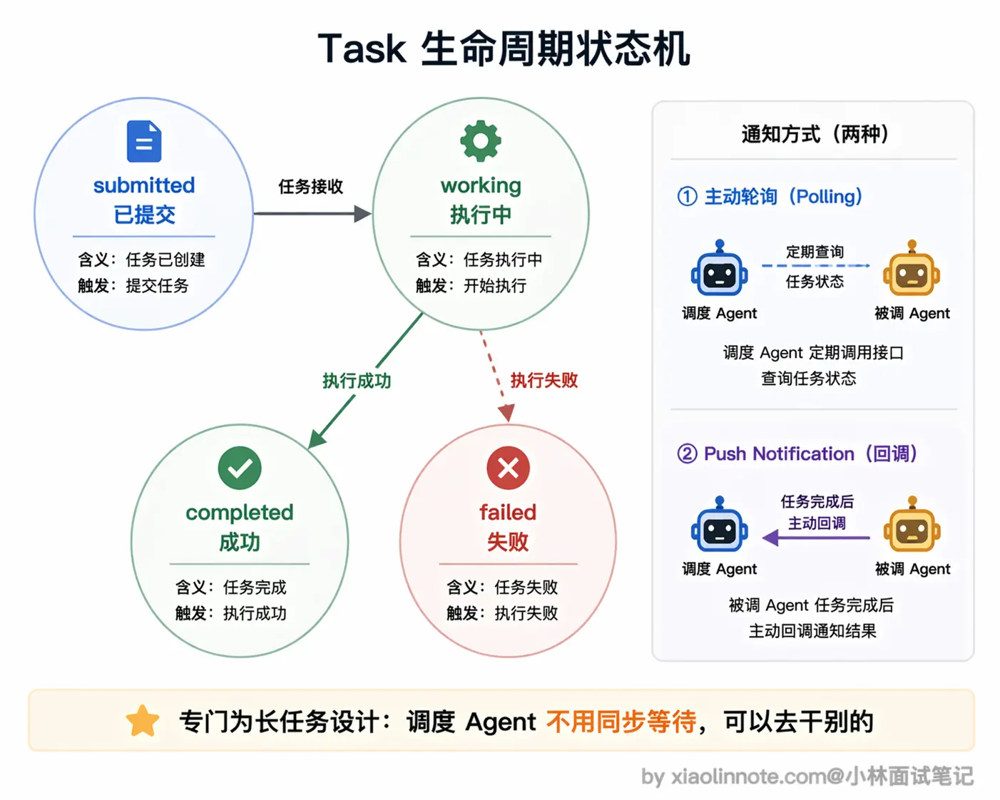

# 什么是 A2A 协议？它和 MCP 协议的区别是什么？

回答：
```
A2A是Google发布的开放协议，专门解决多个AI Agent之间怎么互相通信协作的问题。我理解它和MCP的区别是这样的:MCP解决的是「单个Agent怎么连工具和数据」，A2A解决的是[多个Agent 之间怎么分工协作]。

一个Agent通过A2A可以把子任务委托给另一个专业Agent，接收方按自己的Skill声明承接，支持异步长任务和流式推送结果。

两者是互补的，不冲突:MCP向下连工具，A2A向上连Agent，在复杂的多Agent系统里这两个通常都要用到。
```

## A2A基本知识

**agent_card**: 每个agent都给调度agent(Orchestrator)发一张Agent Card(JSON文件)，包含name、skill、description等等
**Task**: 调度Agent 把一段任务委托给另一个Agent，就是创建一个Task;接收方执行这个Task;完成后把结果作为 Task的产出(artifacts，可以是文本、文件等)返回。Task 有完整的生命周期状态管理。一个Task 刚被创建时是 submitted状态，表示已提交、等待处理。接收方开始执行后变为working状态，最终根据执行结果进入completed(成功)或failed(失败)状态。




