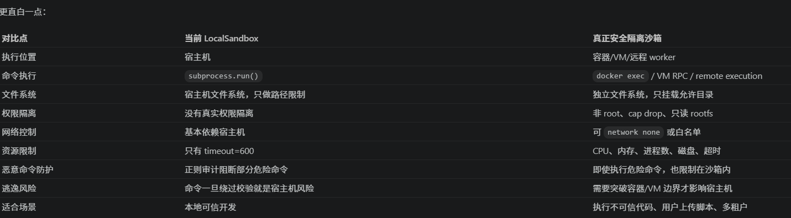

# 介绍一下你的沙箱sandbox

答案:
```
我项目里的 sandbox 是 Agent Runtime 的受控执行层。它通过 

Sandbox 抽象统一了命令执行和文件操作，

通过 SandboxProvider 管理实例。当前实现是 LocalSandbox，Agent 看到的是 /mnt/user-data/... 这样的虚拟路径，底层会映射到每个 thread 独立的本地工作目录。

工具层把它封装成 bash/read_file/write_file/grep/glob 等 LangChain tools。执行命令时会经过 bash 审计、路径校验、虚拟路径替换、工作目录绑定、输出脱敏和长度截断。需要强调的是，

当前 LocalSandbox 是本地受控执行环境，不是强隔离安全容器；真正生产环境可以替换 Provider 为 Docker/VM 沙箱。
```

# 心智模型
agent 本身，也就是 LLM，并不能直接读硬盘。只能调用工具：
```
ls
read_file
write_file
str_replace
bash
grep
glob
```

调用工具的时候，才会检查路径是否合法：
```
你要读哪里？
你要写哪里？
这个路径是不是允许的虚拟路径？
能不能映射到当前 thread 的真实目录？
是不是 read-only？
```

# 三个文件夹从哪里来
三个核心目录不是 sandbox provider 创建的，而是 ThreadDataMiddleware 管的。

它为每个 thread_id 准备三个目录：
```
{base_dir}/threads/{thread_id}/user-data/workspace
{base_dir}/threads/{thread_id}/user-data/uploads
{base_dir}/threads/{thread_id}/user-data/outputs

存储在 state 中的thread_data中， 
```

所以每个会话线程都有自己独立的一组三目录。在LLM视角下是：
```
/mnt/user-data/workspace
/mnt/user-data/uploads
/mnt/user-data/outputs
```

# sandbox 是谁创建的

创建入口有两个：
1. SandboxMiddleware
lazy_init=True: 不是 agent 一启动就马上创建 sandbox, 而是等第一次工具调用时才创建

但现在项目里 _build_runtime_middlewares(lazy_init=True)，所以通常是首次工具调用时创建。

2. ensure_sandbox_initialized(runtime)

```
如果 runtime.state["sandbox"] 已经有 sandbox_id
  直接 get 这个 sandbox

否则：
  从 runtime/context/config 里拿 thread_id
  调 provider.acquire(thread_id)
  把 {"sandbox_id": sandbox_id} 写回 runtime.state["sandbox"]
  返回 sandbox 实例
```

```python

provider = get_sandbox_provider()
sandbox_id = provider.acquire(thread_id)
runtime.state["sandbox"] = {"sandbox_id": sandbox_id}
sandbox = provider.get(sandbox_id)

```


详细介绍:
```
我的项目里 sandbox 主要负责给 Agent 提供一个受控的文件和命令执行环境。它不是直接让模型操作宿主机，而是把执行能力抽象成统一的 Sandbox 接口，比如 execute_command、read_file、write_file、list_dir、grep、glob 等。

第一层是抽象层。
Sandbox 定义沙箱具备哪些能力，SandboxProvider 负责创建、获取和释放沙箱实例。这样上层 Agent 不关心底层到底是本地执行、Docker 容器，还是未来的远程沙箱，只依赖统一接口。

第二层是当前实现层。
我现在实现的是 LocalSandboxProvider 和 LocalSandbox。LocalSandboxProvider 会根据配置创建一个本地 sandbox 实例，LocalSandbox 内部通过路径映射把 Agent 看到的虚拟路径，比如 /mnt/user-data/workspace，映射到宿主机真实路径，比如 .deer-flow/threads/<thread_id>/user-data/workspace。这样每个会话都有自己的 workspace、uploads、outputs 目录。

第三层是工具层。
backend/sandbox/tools.py 把 sandbox 能力包装成 LangChain tools，比如 bash、read_file、write_file、str_replace、ls、grep、glob。Agent 真正调用的是这些工具，工具内部再通过 ensure_sandbox_initialized() 获取 sandbox 实例，然后执行对应操作。

```

流程大概是:
```
用户提出任务
  -> Agent 判断需要调用工具
  -> ToolNode 调用 sandbox tool
  -> ensure_sandbox_initialized 获取 sandbox
  -> 校验路径和权限
  -> 虚拟路径替换成本地真实路径
  -> LocalSandbox 执行文件操作或命令
  -> 输出结果脱敏，把真实路径替换回虚拟路径
  -> 返回给 Agent
```

如果是执行脚本:
```
Agent 调用 bash 工具
  -> SandboxAuditMiddleware 先审计命令
  -> bash_tool 检查是否允许 host bash
  -> 校验命令里的绝对路径
  -> 将 /mnt/user-data/... 替换成宿主机路径
  -> 给命令加上 workspace cwd
  -> LocalSandbox.execute_command()
  -> subprocess.run() 在本机 shell 中执行
  -> 返回 stdout / stderr / exit code
```


```
LLM 决定调用工具
  -> LangChain ToolNode 执行工具
  -> sandbox.tools 里的 bash/read_file/write_file
  -> SandboxProvider 获取 Sandbox 实例
  -> LocalSandbox 执行真实文件/命令操作
```

# 整体结构：
## 抽象层
核心思想是：先不关心底层是本机、Docker、远程容器，统一抽象成一个 Sandbox。

```text
execute_command()
read_file()
write_file()
update_file()
list_dir()
glob()
grep()

glob(): 匹配文件名 / 目录路径, 
grep(): 匹配文件内部的文本内容
```

所以这里的设计思路是：
```
Agent 不直接操作 OS
Agent 调用工具
工具调用 Sandbox 抽象
具体 Sandbox 再决定如何执行
```


## 2. Provider 层
真正使用哪个 provider 由 config.yaml 决定, 负责创建和管理 Sandbox。当前是 LocalSandboxProvider。

```
config.yaml
  sandbox.use: sandbox.local:LocalSandboxProvider

get_sandbox_provider()
  -> resolve_class("sandbox.local:LocalSandboxProvider")
  -> 创建 LocalSandboxProvider 单例
```


## 3.当前实现：LocalSandboxProvider

做了两件事：
1. 设置路径映射
2. 返回一个 singleton 的 LocalSandbox("local")

把 sandbox 能力包装成 LangChain tools

```python
_singleton: LocalSandbox | None = None

class LocalSandboxProvider(SandboxProvider):
    def __init__(self):
        self._path_mappings = self._setup_path_mappings()

    def acquire(self, thread_id: str | None = None) -> str:
        global _singleton
        if _singleton is None:
            _singleton = LocalSandbox("local", path_mappings=self._path_mappings)
        return _singleton.id

    def get(self, sandbox_id: str) -> Sandbox | None:
        if sandbox_id == "local":
            if _singleton is None:
                self.acquire()
            return _singleton
        return None
```
重点:
```
LocalSandboxProvider 不会为每个 thread 创建一个独立进程/容器
它只有一个 LocalSandbox 单例
sandbox_id 固定是 "local"
隔离主要靠路径规则，不靠 OS 容器隔离
```

###  路径映射
LocalSandboxProvider 会建立一些 container path 到 host path 的映射。
```python
PathMapping(
    container_path=config.skills.container_path,
    local_path=str(skills_path),
    read_only=True,
)

# 在配置中类似：
skills:
  path: C:/Users/BAI/Desktop/project/skills
  container_path: ../skills

默认情况下：
/mnt/skills  →  C:/Users/BAI/Desktop/project/skills

```

它还支持 config.yaml 里的 custom mounts：
```
sandbox:
  mounts:
    - host_path: ...
      container_path: ...
      read_only: true/false
```

所以 agent 可访问的不止三目录，完整允许族大概是:
```
/mnt/user-data/*
skills container path，只读
config.yaml 里配置的 custom mounts
```

## 真正限制路径的核心代码

```python
validate_local_tool_path(path, thread_data, read_only=False)

/mnt/user-data/*              读写
/mnt/skills/*                 只读
custom mount paths            按配置 read_only 决定

必须用虚拟路径：
/mnt/user-data/uploads/prime.py
/mnt/user-data/workspace/foo.py
/mnt/user-data/outputs/result.md
```

不在这些范围就报错：
```
raise PermissionError(
    "Only paths under /mnt/user-data/, /mnt/skills/, /mnt/acp-workspace/, or configured mount paths are allowed"
)
```

## 4. LocalSandbox：真正执行命令和文件操作
它做两件核心事情：
1. 虚拟路径和本地路径互转
```python
def _resolve_path(self, path: str) -> str:
    for mapping in sorted(self.path_mappings, key=lambda m: len(m.container_path), reverse=True):
        if path_str == mapping.container_path or path_str.startswith(mapping.container_path + "/"):
            relative = path_str[len(mapping.container_path):].lstrip("/")
            return str(Path(mapping.local_path) / relative)
    return path_str

它会根据 thread_data 把虚拟路径映射到真实宿主机路径，比如：
/mnt/user-data/uploads/prime.py  ->   C:/Users/BAI/Desktop/project/.deer_flow/threads/<thread_id>/user-data/uploads/prime.py
然后调用sandbox.read_file(path)

LocalSandbox 里再执行真实文件读取。

读完后，如果输出里出现宿主机路径，系统会尽量把它反向替换回虚拟路径，避免把真实 host path 暴露给 LLM。

```

2. 执行命令。
```python
def execute_command(self, command: str) -> str:
    resolved_command = self._resolve_paths_in_command(command)
    shell = self._get_shell()

    if os.name == "nt":
        if self._is_powershell(shell):
            args = [shell, "-NoProfile", "-Command", resolved_command]
        elif self._is_cmd_shell(shell):
            args = [shell, "/c", resolved_command]
        else:
            args = [shell, "-c", resolved_command]

        result = subprocess.run(
            args,
            shell=False,
            capture_output=True,
            text=True,
            timeout=600,
        )
    else:
        result = subprocess.run(
            resolved_command,
            executable=shell,
            shell=True,
            capture_output=True,
            text=True,
            timeout=600,
        )
```

# Agent 怎么拿到 sandbox？
入口在中间件: ```middlewares = [ThreadDataMiddleware(lazy_init=lazy_init),SandboxMiddleware(lazy_init=lazy_init),...]```; lazy_init=True，所以 before_agent() 不立刻创建 sandbox。

真正创建时:
文件：tools.py (line 817)

```python
def ensure_sandbox_initialized(runtime):
    sandbox_state = runtime.state.get("sandbox")

    if sandbox_state is not None:
        sandbox_id = sandbox_state.get("sandbox_id")
        sandbox = get_sandbox_provider().get(sandbox_id)
        if sandbox is not None:
            return sandbox

    thread_id = runtime.context.get("thread_id")
    provider = get_sandbox_provider()
    sandbox_id = provider.acquire(thread_id)

    runtime.state["sandbox"] = {"sandbox_id": sandbox_id}

    sandbox = provider.get(sandbox_id)
    return sandbox
```

执行逻辑
```text
第一次工具调用
  -> runtime.state 里还没有 sandbox
  -> get_sandbox_provider()
  -> provider.acquire(thread_id)
  -> 得到 sandbox_id = "local"
  -> runtime.state["sandbox"] = {"sandbox_id": "local"}

后续工具调用
  -> 直接复用 runtime.state 里的 sandbox_id
```

# Host Bash 怎么限制路径
在 LocalSandbox 下，bash 命令会先经过：
```python
validate_local_bash_command_paths(command, thread_data)
```

原则是：
```text
命令里的用户数据路径必须用 /mnt/user-data/...
不要直接写宿主机绝对路径
```


因为 shell 命令太灵活，比如环境变量、脚本内容、工具间接访问等，都可能绕过简单路径扫描。所以 LocalSandbox + Host Bash 只能用于“完全信任的本地环境”。


# 命令实现

ls、read_file、write_file、str_replace、bash 这些都是 LangChain 工具。它们的实现位置在 backend/sandbox/tools.py (line 989) 附近。

可以先用一句话概括：这些工具是 LLM 能调用的 LangChain Tool；但真正读写文件/执行命令的是 sandbox 对象。工具负责参数入口、权限校验、路径转换、错误处理；sandbox 负责底层执行。

## langchain工具

例如：
```python
@tool("bash", parse_docstring=True)
def bash_tool(...)

@tool("ls", parse_docstring=True)
def ls_tool(...)

@tool("read_file", parse_docstring=True)
def read_file_tool(...)

```

## 这些工具怎么进入 agent 的工具列表

它们不是硬编码直接塞进 agent，而是先写在 config.yaml 里：

## 工具和 sandbox 的关系
LangChain 工具不是直接打开文件。以 read_file 为例，它大概做这些事：
```
1. 从 runtime 里拿当前 thread 的 state
2. 确保 sandbox 已初始化
3. 判断当前是不是 LocalSandbox
4. 校验 path 是否允许访问
5. 把虚拟路径解析成真实宿主机路径
6. 调 sandbox.read_file(path)
7. 对结果做截断/格式化/错误脱敏
8. 返回字符串给 LLM
```

所以关系是：
```
LangChain Tool:
  面向 LLM 的工具接口

Sandbox:
  面向系统的执行后端

sandbox/tools.py:
  两者之间的适配层
```

## 工具怎么拿到 sandbox

核心函数在 tools.py (line 817)：

```
def ensure_sandbox_initialized(runtime) -> Sandbox:

如果 runtime.state["sandbox"] 已经有 sandbox_id：
  用 get_sandbox_provider().get(sandbox_id) 拿 sandbox

否则：
  从 runtime context/config 里拿 thread_id
  provider.acquire(thread_id)
  把 sandbox_id 写入 runtime.state["sandbox"]
  provider.get(sandbox_id)

每个工具都会实现
sandbox = ensure_sandbox_initialized(runtime)
```

## read_file 怎么实现
入口
```python
@tool("read_file", parse_docstring=True)
def read_file_tool(runtime, description, path, start_line=None, end_line=None):

sandbox = ensure_sandbox_initialized(runtime)

if is_local_sandbox(runtime):
    thread_data = get_thread_data(runtime)
    validate_local_tool_path(path, thread_data, read_only=True)

    if _is_skills_path(path):
        path = _resolve_skills_path(path)
    elif _is_acp_workspace_path(path):
        path = _resolve_acp_workspace_path(path, thread_id)
    elif not _is_custom_mount_path(path):
        path = _resolve_and_validate_user_data_path(path, thread_data)

content = sandbox.read_file(path)
return content
```
关键几步：
```
validate_local_tool_path:  判断你有没有权限读这个虚拟路径
_resolve_and_validate_user_data_path:  把 /mnt/user-data/... 转成真实 host 路径，并确认没有越界
```

最后真正读文件的是：
```python
sandbox.read_file(path)
在 LocalSandbox 里：local_sandbox.py (line 279)
def read_file(self, path):
    resolved_path = self._resolve_path(path)
    with open(resolved_path, encoding="utf-8") as f:
        return f.read()
```


```
读文件/写文件不需要 shell
直接走 LocalSandbox.read_file/write_file
底层就是 open(...).read() / open(...).write()
写文件还加了锁，避免并发写同一个文件。
```

## 8. 可以执行代码
比如agent运行: ```python /mnt/user-data/workspace/demo.py```
实际过程:
```
/mnt/user-data/workspace/demo.py
  -> 替换成
C:\Users\BAI\Desktop\project\.deer-flow\threads\<thread_id>\user-data\workspace\demo.py

再加 cwd：
cd <workspace> && python <真实路径>
最后：
subprocess.run([...])

在window大概是:
subprocess.run(
    ["powershell.exe", "-NoProfile", "-Command", resolved_command],
    shell=False,
    capture_output=True,
    text=True,
    timeout=600,
)
```

# 设计理念

```
先抽象统一执行接口
再用 Provider 支持不同执行后端
当前用 LocalSandbox 适配本地开发
通过虚拟路径限制 Agent 的文件视野
通过 middleware 审计危险 bash
通过 config 控制是否暴露 bash

Sandbox 抽象层：统一能力
Provider 层：可替换执行后端
Tools 层：把能力暴露给 Agent
Middleware 层：做审计、注入、生命周期管理
Path 层：用 /mnt/user-data 屏蔽宿主机真实路径
```
当前实现更准确的名字其实是：```本地受控执行环境```, 而不是```真正安全隔离沙箱```

# 真正的sandbox是什么样子的?

当前:
```
Agent -> bash_tool -> LocalSandbox.execute_command()
      -> subprocess.run()
      -> 在宿主机执行
```
真正的:
```
Agent -> bash_tool -> IsolatedSandbox.execute_command()
      -> 容器 / VM / microVM / 远程 worker 内执行
      -> 只挂载允许目录
      -> 限制 CPU/内存/网络/权限/生命周期
```

典型架构:
```
Backend 主进程
  |
  | 1. 创建隔离环境
  v
Sandbox Provider
  |
  | 2. 启动 container / VM / microVM
  v
Isolated Runtime
  - 独立文件系统
  - 非 root 用户
  - 只读基础镜像
  - 只挂载 /mnt/user-data
  - 限制网络
  - 限制 CPU / 内存 / 进程数
  - 超时自动销毁
  |
  | 3. 在里面执行命令
  v
python test.py / npm test / bash script
```
命令执行不是宿主机```subprocess.run("python xxx")```, 而是```docker exec <container> python /mnt/user-data/workspace/test.py```

## 本质区别



命令仍是当前机器执行,
```
防护措施:
validate_local_bash_command_paths()
SandboxAuditMiddleware
allow_host_bash
/mnt/user-data 路径映射

但都属于应用层防护,应用层防护的问题是：只要某个命令形式没被识别、某个路径绕过没覆盖、某个工具行为超出预期，就可能碰到宿主机。
```

## 真正sandbx具备的能力
- 文件系统隔离:容器内只能看到自己的 rootfs 和挂载目录。
- 权限降级: 容器内进程不应该是宿主机高权限用户。
- 资源限制: 防止死循环、内存打爆、fork bomb。
- 网络隔离: 默认禁网，或者只允许特定域名/代理。
- 生命周期隔离: 每个 thread 可以复用一个容器，但要有 idle timeout 和最终销毁。
- 挂载控制: 只把该会话的数据目录挂进去。
- 输出脱敏和审计:  即使有强隔离，也仍然需要审计和日志：

