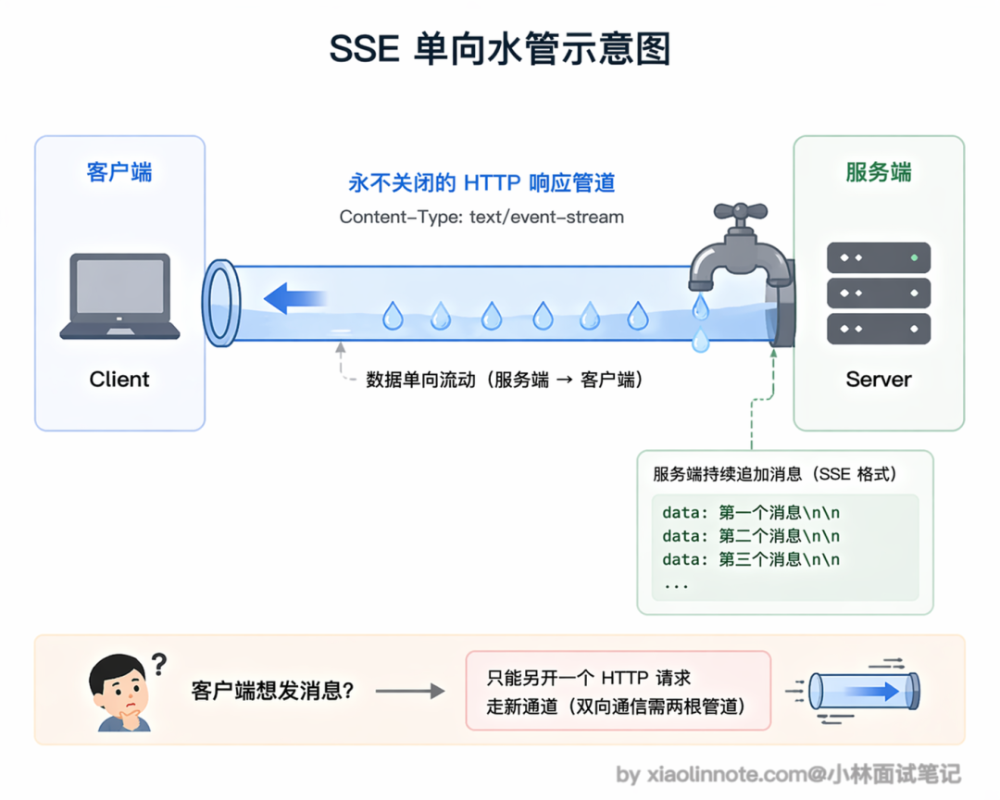
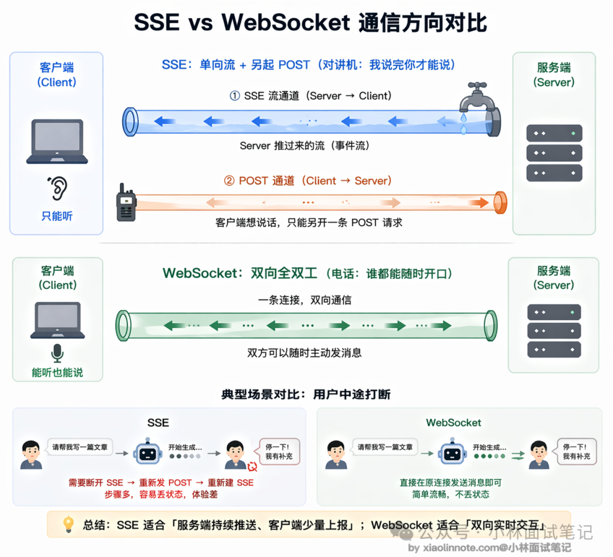
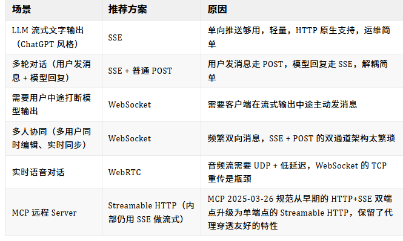
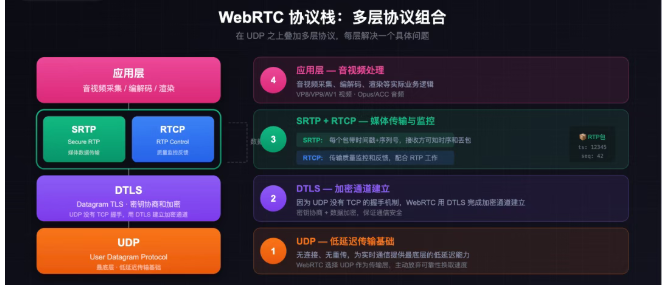

# SSE Vs WebSocket

本质总结一下：
WebSocket 的本质是：客户端和某一台后端服务器，直接建立了一条永久不断开的 TCP 网络通道。
连接方式： HTTP + 协议升级。**这条 TCP 连接就永久绑定在客户端和服务器 A 之间了**
存储：
网络层状态：TCP 连接本身是端到端的，由「客户端 IP + 端口 + 服务器 A IP + 端口」唯一确定，所有后续的消息数据包，都会直接发给服务器 A，不可能中途跑到别的服务器上（网络设备只会按这个固定地址转发）。

业务层状态：这个连接的用户身份、订阅的话题、会话上下文等数据，默认都存在服务器 A 的内存里，其他服务器拿不到。

SSE：每一次连接（包括初始连接和重连）都是完全独立的普通 HTTP 请求，负载均衡器可以把它路由到任意一台可用的后端服务器，不需要绑定固定机器。

类比：WebSocket：单独聊天；SSE：客服电话，不知道谁接

```
我觉得最核心的区别是通信方向: SSE 是服务端单向推，客户端只能接收，想发消息只能另起-个HTTP请求;WebSocket是全双工，双方都可以随时主动发消息。

对于LLM流式输出这种「模型一直在推token、用户只是看」的场景，SSE完全够用，而且轻量、HTTP原生支持、运维简单，OpenAI和Anthropic的API用的都是SSE。

Websocket的复杂性只有在真正需要双向实时交互的时候才值得引入，比如用户要在模型说话过程中随时打断。

两者各有局限:SSE在HTTP/1.1下有连接数上限，只支持文本传输;WebSocket有状态、横向扩展麻烦，还容易被企业代理或防火墙拦掉。大多数LLM文字对话产品用sSE就够了。
```

## 先从 HTTP 的本质说起

标准的 HTTP 请求是「一问一答」模型：客户端发请求，服务端返回响应，连接关闭（或者进连接池等待下次复用）。

服务端在任何时候都不能主动「推」数据给客户端，它只能被动等客户端来问。你可以把它想象成打电话：你说一句「你好」，对方回一句「你好」，然后挂电话，这条线就断了。这套机制在传统 Web 里够用，但 AI 对话场景不行。

模型生成一个完整回答需要几秒甚至十几秒，如果等全部生成完再一次性返回，用户只能干瞪着空白屏幕等待，体验极差。我们需要的效果是：模型生成一个词就推一个词，用户实时看到文字逐渐出现，就像 ChatGPT 那样一个字一个字「打」出来。这就需要连接保持打开、服务端能主动持续往外推数据，HTTP 的「问一答一然后断」做不到这件事。

## SSE：用普通 HTTP「撑开」一条单向水管

SSE（Server-Sent Events，服务器推送事件）本质上是对 HTTP 的一种「巧用」，不是新协议，而是 HTTP/1.1 里本来就有的特性，只不过以前很少用。

它的做法是：客户端发一个普通 HTTP GET 请求，但在请求头里声明 Accept: text/event-stream，告诉服务端「我想收流式数据」。服务端收到后，不关闭连接，而是保持连接持续打开，不停往里写数据。

仍然是HTTP响应，




有必要讲一下 SSE 的消息格式是什么样的，因为这直接决定了它为什么这么好用。SSE 的数据不是 JSON，而是一种非常简单的纯文本格式，每条消息以 data: 开头，后面跟数据内容，结尾是两个换行符。

SSE 之所以成为 LLM 流式输出的行业标准，还有一个很关键但容易被忽视的原因：文字传输天然适合 TCP 的可靠有序传输。模型输出是一个个 token 组成的连续文本，如果中间某个 token 丢了，整段话的意思可能完全变了，顺序乱了更是无法阅读。

## WebSocket：从 HTTP 升级成真正的双向信道

WebSocket 是一个独立的协议，建立在 TCP 之上，但不是 HTTP 的特性。它的建立过程有一个特殊的「握手仪式」：客户端先发一个看起来像普通 HTTP 请求的东西，但请求头里带了一句话「我想升级成 WebSocket」。

服务端如果同意，回一个 101 Switching Protocols 的响应，从这一刻起，这条 TCP 连接就「变性」了，不再遵循 HTTP 的一问一答规则，变成了一条双方都可以随时说话的全双工信道。你可以把这个转变想象成：**原来是对讲机（你说完按按钮让对方说），升级成了电话（双方都可以随时开口，谁都不用等谁）。**


和 SSE 最本质的区别是通信方向。SSE 只有服务端能主动推，客户端想发消息必须另起一个 HTTP 请求，两个方向用了两套机制；

WebSocket 是真正的双向，客户端和服务端都可以随时主动发消息，对方立刻就能收到，没有任何「谁先说话」的限制，一条连接搞定两个方向。

用「用户要在模型说话中途打断」这个场景来感受两者的差别：用 SSE 时，用户想打断，只能先关掉当前 SSE 流（第一个请求结束），再发一个新的 POST 请求（第二个请求开始），这两个动作之间有一个明显的断-重连过程，操作上有割裂感；用 WebSocket 时，用户直接在同一条连接里发送「停止」指令，服务端立刻收到，立刻停止生成，整个过程流畅、无缝，真正的实时双向交互。




## SSE 局限性

### SSE 的单向性带来的第一个麻烦，是架构上的「双通道尴尬」。

SSE 只能从服务端推向客户端，用户发消息必须走一个独立的 POST 请求，这意味着同一个对话用了两条通道，用户发消息走 POST，模型回复走 SSE，两者之间要靠一个 conversation ID 关联起来。

服务端收到 POST 请求后，找到对应的 SSE 长连接，把模型输出推过去。对于简单场景这套机制够用，但状态管理比 WebSocket 的单一通道复杂，出问题时排查链路也更长。

### 第二个容易被忽视的坑是 HTTP/1.1 的连接数限制。

浏览器对同一个域名的 HTTP/1.1 连接有 6 条的上限，SSE 占一条长连接，如果用户同时开了多个标签页，第 7 个标签页的 SSE 请求会被浏览器排队等待，导致某些标签页没有响应，看上去就是「页面卡死了」。

HTTP/2 通过多路复用解决了这个问题，一条 TCP 连接上可以跑无数条逻辑流，所以现代部署一般要求 HTTP/2，这个问题也就消失了。但如果你的用户环境里有老浏览器或者不支持 HTTP/2 的代理，这就是一个真实的坑。

### SSE 只能传文本这条限制。

传语音或者图片时，必须先做 Base64 编码才能用 SSE 传输，数据量会膨胀约 33%，接收端还要额外解码，延迟和 CPU 开销都不小。实时语音场景下这个代价完全不可接受，所以实时语音要用 WebRTC 而不是 SSE。

## WebSocket 的局限：有状态带来的扩展麻烦

WebSocket 最麻烦的问题是「有状态」。

每条 WebSocket 连接在建立时被负载均衡器路由到某一台后端服务器，之后这个用户的所有消息都必须发到同一台服务器，因为连接状态就保存在那里。

当你想横向扩容、加新的机器时，新机器接不到老连接，老连接的用户无法迁移到新机器，扩容的效果大打折扣。

详细解释：
```
比如：比如你一开始有 2 台服务器，每台扛了 10000 个 WebSocket 长连接，总共有 20000 个在线用户。现在用户涨到 30000，你加了 2 台新服务器想分担压力 —— 但原来的 20000 个老用户的连接，还牢牢粘在原来的 2 台老服务器上，新服务器只能接到之后新进来的 10000 个用户。结果就是：老服务器还是扛着 10000 个连接，压力一点没减，新服务器只扛了 5000 个，资源完全浪费，扩容根本没解决老机器的压力问题。
```

常见的解决办法是把**连接状态外移到 Redis 等共享存储，通过发布订阅机制把消息中转到正确的服务器，但这让架构明显变复杂，多了一跳，延迟也增加了。**

详细解释：
```
1. 用Redis加一层消息中转，把所有用户的「连接 ID + 所在服务器」的映射关系，存在共享的 Redis 里，所有服务器都能查到。

2. 所有服务器都订阅 Redis 的消息频道。当用户 1 在服务器 A 要给用户 2 发消息时：
服务器 A 先去 Redis 查：用户 2 连在服务器 B 上
服务器 A 把消息发到 Redis 的公共频道
服务器 B 从 Redis 收到这条消息，再通过自己和用户 2 的 WebSocket 连接，把消息发出去

代价：
架构复杂度爆炸：你需要维护 Redis 的高可用、处理 Pub/Sub 的消息丢失 / 重复、维护连接映射的一致性、处理连接断开后的映射清理，还要解决各种边缘情况，整个架构比普通 HTTP 服务复杂好几倍。

延迟显著增加：原来的消息路径是「客户端→服务器 A→客户端 B」，现在变成了「客户端→服务器 A→Redis→服务器 B→客户端 B」，多了一次跨服务器的网络跳转（就是原文说的「多了一跳」），延迟至少增加几毫秒到几十毫秒，对实时性要求高的场景影响很大。

```

相比之下，SSE 的每次请求都是普通 HTTP，负载均衡器可以把任意请求路由到任意后端，横向扩展非常简单，这是 SSE 在大规模部署场景的一个明显优势。


## WebSocket 的局限：代理和防火墙穿透

很多企业的 HTTP 代理（比如 Squid）、老版本 CDN、某些安全网关不支持 WebSocket 的 Upgrade 握手，直接把这个请求当成异常 HTTP 请求拒掉，导致 WebSocket 连接建立失败。

SSE 就不会有这个问题，它始终是普通 HTTP 请求，任何代理都能透传，不需要任何特殊配置。

这也是为什么早期 MCP 协议的远程传输选择了 SSE 而不是 WebSocket，MCP Server 需要在各种复杂的网络环境下都能工作，SSE 对这些环境的兼容性好得多（MCP 在 2025 年 3 月的规范更新里进一步升级到了 Streamable HTTP，本质上还是走 HTTP + SSE 流，详见 13 题）。

第三个是 WebSocket 没有内置的请求-响应配对机制。HTTP 里每个请求有自己的响应，天然一一对应。WebSocket 里消息就是消息，服务端发来一条消息，你不知道它对应哪个请求，需要自己在消息里加请求 ID，在客户端维护请求 ID 到等待回调的映射表，才能实现「发出一条消息，等待特定响应」的语义。




# WebSocket 和 WebRTC

```
我理解核心原因是 WebSocket 基于 TCP，而 TCP 的可靠性设计在实时语音场景里反而是负担。
语音可以容忍丢包，但绝对不容忍延迟；一旦网络抖动丢了包，TCP 强制等重传，后续所有音频都得跟着等，延迟一堆积通话就卡。
WebRTC 走的是 UDP，丢包了不等重传，直接用插值算法填补，用一点点音质损失换来稳定的低延迟，延迟能控制在 50 到 150 毫秒。
另外 WebRTC 还内置了回声消除、噪声抑制、自适应码率这些语音处理能力，这些用 WebSocket 都得自己实现。
所以 OpenAI Realtime API 这类实时语音产品选 WebRTC，就是因为 TCP 根本撑不住语音场景的延迟要求。
```

语音和文字完全不同：
```
传输文字时，你希望每个字符都能准确到达，顺序不能乱，丢一个字母整段话可能就不对了。 —— 需要严格正确

传输语音时，情况完全反过来。人类大脑对语音时序极其敏感，当两个人对话时，超过 200ms 的延迟就会让人明显感觉到「卡顿」，超过 400ms 就会开始出现「说话串线」的尴尬：你以为对方说完了开口说话，结果对方话还没说完。—— 不允许出现延迟
```

## WebRTC 的根本：选择 UDP，主动放弃可靠性

UDP 完全不管可靠性，发出去的包丢了就丢了，没有重传，也没有等待。

WebRTC 在 UDP 之上自己实现了一套对语音友好的丢包处理策略：当一个音频帧丢失时，不是等待重传，而是用「丢包隐藏（Packet Loss Concealment）」技术自动填补，用前后帧插值生成一段听起来合理的音频来替代，整体播放不中断，只是极短暂的音质轻微下降，人耳感知不到。

## WebRTC 不是单一协议，而是一套协议组合



```
面试回答这道题，第一个必须说到的核心点是底层协议的区别：WebSocket 基于 TCP，WebRTC 基于 UDP。TCP 丢包强制重传，后续数据全部等待，延迟不可控；UDP 不重传，WebRTC 用丢包隐藏技术（插值填补）处理丢失的音频帧，用微小的音质损失换取稳定的低延迟。语音场景的铁律是「容忍丢包，绝不容忍延迟」，TCP 的设计哲学和这个需求正好相反。

第二个要点是 WebRTC 内置的音频处理能力。回声消除（AEC）、噪声抑制（NS）、自动增益控制（AGC）、自适应码率（ABR）这些都是 WebRTC 原生支持的，用 WebSocket 做语音这些全得自己造轮子，工程量巨大。这不只是传输协议的差异，而是一整套音视频工程能力的差异。

第三个加分点是 WebRTC 的连接建立机制：SDP 信令交换 + ICE/STUN/TURN NAT 穿透。特别是能说清楚「WebRTC 建连时仍然需要 WebSocket 做信令通道，两者是配合关系而不是替代关系」，会让面试官觉得你对整个架构有完整的理解。
```


